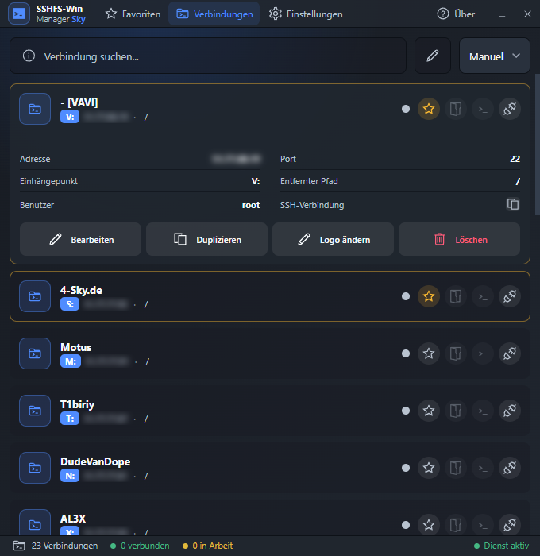
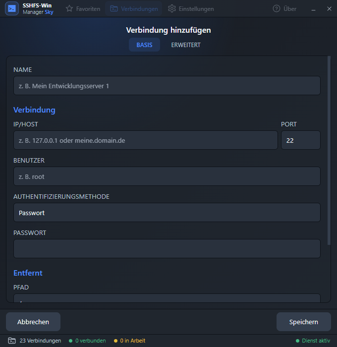
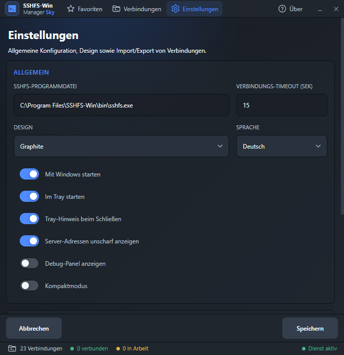
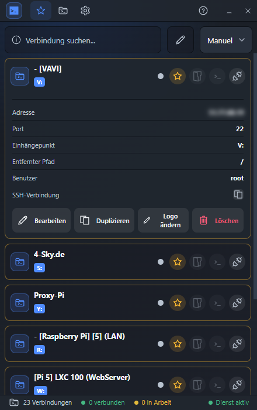

# SSHFS-Win Manager Sky

A clean, single-window GUI for mounting remote SSH/SFTP folders as local Windows drives with SSHFS.

**Sky Edition** is a redesign of [SSHFS-Win Manager Evo](https://github.com/emulsion-io/sshfs-win-manager-evo) by Fabrice Simonet, based on the original [SSHFS-Win Manager](https://github.com/evsar3/sshfs-win-manager) by Evandro Araujo.

> **Transparency:** This edition was built in an open AI pair-programming workflow with Claude (Fable 5, Anthropic).

## Screenshots

<p align="center">
  
</p>

*Connections — click a server to unfold its details and actions inline.*

<p align="center">
  
</p>

*Add & edit connections — opens inside the same window, no popups.*

<p align="center">
  
</p>

*Settings — theme, language, tray behavior, passkey encryption, address blur.*

<p align="center">
  
</p>

*Compact mode — 440 px wide with icon tabs, made to sit at the edge of your screen.*

## What's different from Evo

Evo modernized the original app; Sky rethinks how it looks and feels:

- **One window for everything.** Frameless, fixed-size, with a top tab bar and a slim status bar. Connection details, adding and editing all happen inline — no popup windows, no side panels.
- **Compact mode** for keeping the app docked at the edge of your screen.
- **Quieter design.** Small native-utility feel instead of a website in a window; drag the window from anywhere.
- **Optional password encryption.** The passkey can be switched on or off in Settings — your choice between convenience and encrypted storage.
- **Privacy on screen.** Optionally blur server addresses in the UI (hover to reveal) — handy for screenshots and screen sharing.
- **Tray control.** Choose whether the app starts hidden in the tray with Windows, and get a real notification when closing to tray.
- **More languages.** German, Spanish, Italian and Chinese added to English and French.
- **Seamless switch.** On first start, your Evo connections and settings are migrated automatically.

## Features

Everything that made Evo solid is untouched underneath:

- Mount remote SSH/SFTP folders via SSHFS, with automatic free drive letter assignment.
- Favorites, search, sorting and reordering, custom per-connection icons.
- Open a connection directly in a terminal (`>_` button) — Tabby if installed, otherwise the system terminal. One-click copy of the equivalent `ssh` command.
- Auto-connect at startup, executed sequentially to avoid collisions; automatic reconnect option.
- JSON import/export of connections, import of legacy SSHFS-Win Manager configurations.
- IPv6 support, advanced SSHFS command-line options, themes, debug panel with connection logs.
- Runs in the system tray, starts with Windows.

### Authentication modes

- Private Key
- Private Key + Passphrase
- Private Key + PAM/OTP
- Private Key + Passphrase + PAM/OTP
- Password
- Password (ask on connect)
- PAM/OTP only (no key)

PAM/OTP modes use `keyboard-interactive` and work with PAM, TOTP, Radius or MFA setups. Secrets entered in connection prompts are never written to the configuration.

### Password security

Stored passwords are encrypted with `AES-256-GCM`, using a key derived from a global passkey via `scrypt`. The passkey itself is never stored; you choose how long it is kept in memory (always ask, 1 hour, 12 hours, 1 day, 2 days). Legacy plain-text passwords are migrated automatically.

If you prefer convenience over encryption, the passkey can be turned off in Settings — passwords are then stored in plain text, with an explicit warning.

## Installation

**Step 1** — Install [SSHFS-Win](https://github.com/winfsp/sshfs-win) (includes WinFsp). Follow their installation instructions.

**Step 2** — Download the latest installer from [Releases](https://github.com/2ndSky95/sshfs-win-manager-sky/releases) and run it.

**Step 3** — Add your connections and enjoy!

Coming from Evo? Install Sky, check that your connections are there, then uninstall Evo (otherwise two tray apps run in parallel).

## Build from source

```
npm install
npm run dev        # development with hot reload
npm run build:win  # NSIS installer in build/
```

## Credits & license

- Original: [SSHFS-Win Manager](https://github.com/evsar3/sshfs-win-manager) — Evandro Araujo
- Evo: [SSHFS-Win Manager Evo](https://github.com/emulsion-io/sshfs-win-manager-evo) — Fabrice Simonet ([emulsion.io](https://emulsion.io))
- Sky: [4-sky.de](https://4-sky.de), built with Claude (Fable 5)

MIT license. Original copyright and license notices are preserved.
