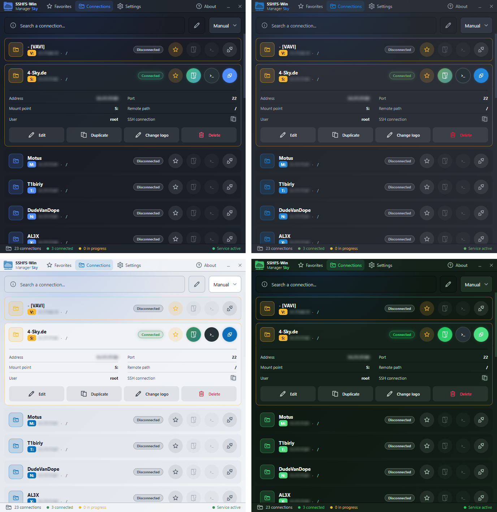

# SSHFS-Win Manager Sky

A clean, single-window GUI for mounting remote SSH/SFTP folders with SSHFS — as drive letters on Windows, as folders under `~/Mounts` on macOS and Linux.

🌐 **UI languages:** English · Deutsch · Français · Español · Italiano · 中文

**Sky Edition** is a redesign of [SSHFS-Win Manager Evo](https://github.com/emulsion-io/sshfs-win-manager-evo) by Fabrice Simonet, based on the original [SSHFS-Win Manager](https://github.com/evsar3/sshfs-win-manager) by Evandro Araujo.

> **Transparency:** This edition was built in an open AI pair-programming workflow with Claude (Fable 5, Anthropic).

## Screenshots

<p align="center">
  <br>
  <em>Connections — click a server to unfold its details and actions inline.</em>
</p>

<p align="center">
  <br>
  <em>Add & edit connections — opens inside the same window, no popups.</em>
</p>

<p align="center">
  <br>
  <em>Settings — theme, language, tray behavior, passkey encryption, address blur.</em>
</p>

<p align="center">
  <br>
  <em>Compact mode — 440 px wide with icon tabs, made to sit at the edge of your screen.</em>
</p>

<p align="center">
  <br>
  <em>A few of the built-in themes — Graphite, Classic dark, Classic light and Forest night.</em>
</p>

## What's different from Evo

Evo modernized the original app; Sky rethinks how it looks and feels:

- **Runs on macOS and Linux.** Building on Evo's multi-OS groundwork: FUSE-T zero-config on macOS (menu bar template icon, LaunchAgent autostart, Finder volumes), XDG autostart and clean mount handling on Linux, auto mount folders under `~/Mounts` that are removed again on disconnect.

- **One window for everything.** Frameless, fixed-size, with a top tab bar and a slim status bar. Connection details, adding and editing all happen inline — no popup windows, no side panels.
- **Compact mode** for keeping the app docked at the edge of your screen.
- **Quieter design.** Small native-utility feel instead of a website in a window; drag the window from anywhere.
- **Optional password encryption.** The passkey can be switched on or off in Settings — your choice between convenience and encrypted storage.
- **Privacy on screen.** Optionally blur server addresses in the UI (hover to reveal) — handy for screenshots and screen sharing.
- **Tray control.** Choose whether the app starts hidden in the tray with Windows, and get a real notification when closing to tray.
- **More languages.** English, French, German, Spanish, Italian and Chinese (default is English).
- **Seamless switch.** On first start, your Evo connections and settings are migrated automatically.

## Features

Everything that made Evo solid is untouched underneath:

- Mount remote SSH/SFTP folders via SSHFS, with automatic free drive letter assignment.
- Favorites, search, sorting and reordering, custom per-connection icons.
- Open a connection directly in a terminal (`>_` button) — Tabby if installed, otherwise the system terminal. One-click copy of the equivalent `ssh` command.
- Auto-connect at startup, executed sequentially to avoid collisions; automatic reconnect option.
- JSON import/export of connections, import of legacy SSHFS-Win Manager configurations.
- IPv6 support, advanced SSHFS command-line options, themes, debug panel with connection logs.
- Runs in the system tray, starts with Windows.

### Authentication modes

- Private Key
- Private Key + Passphrase
- Private Key + PAM/OTP
- Private Key + Passphrase + PAM/OTP
- Password
- Password (ask on connect)
- PAM/OTP only (no key)

PAM/OTP modes use `keyboard-interactive` and work with PAM, TOTP, Radius or MFA setups. Secrets entered in connection prompts are never written to the configuration.

### Password security

Stored passwords are encrypted with `AES-256-GCM`, using a key derived from a global passkey via `scrypt`. The passkey itself is never stored; you choose how long it is kept in memory (always ask, 1 hour, 12 hours, 1 day, 2 days). Legacy plain-text passwords are migrated automatically.

If you prefer convenience over encryption, the passkey can be turned off in Settings — passwords are then stored in plain text, with an explicit warning.

## Installation

### Windows

**Step 1** — Install [SSHFS-Win](https://github.com/winfsp/sshfs-win) (includes WinFsp). Follow their installation instructions.

**Step 2** — Download the latest installer (`sshfs-win-manager-sky-setup-*.exe`) from [Releases](https://github.com/2ndSky95/sshfs-win-manager-sky/releases) and run it.

**Step 3** — Add your connections and enjoy!

Coming from Evo? Install Sky, check that your connections are there, then uninstall Evo (otherwise two tray apps run in parallel).

### macOS (Apple Silicon)

**Step 1** — Install [FUSE-T](https://github.com/macos-fuse-t/fuse-t) and its SSHFS build. FUSE-T is kext-less: no system extension approval, no reboot, no security downgrade.

With [Homebrew](https://brew.sh):

```
brew tap macos-fuse-t/homebrew-cask
brew install fuse-t
brew install macos-fuse-t/homebrew-cask/fuse-t-sshfs
```

Without Homebrew: download the `fuse-t` and `fuse-t-sshfs` `.pkg` installers from the [FUSE-T releases](https://github.com/macos-fuse-t/fuse-t/releases) and double-click both.

> **Note on macFUSE:** the classic macFUSE (kernel extension) also works in principle, but requires kext approval, a reboot and — on Apple Silicon — reduced boot security. FUSE-T needs none of that and is the recommended and default setup; the app looks for it at `/usr/local/bin/sshfs` automatically.

**Step 2** — Download `sshfs-win-manager-sky-v*-arm64.dmg` from [Releases](https://github.com/2ndSky95/sshfs-win-manager-sky/releases), open it and drag the app into **Applications**.

**Step 3** — First launch: the app is not notarized by Apple, so **right-click the app → Open → Open** (only needed once).

**Step 4** — Add your connections. Mounts appear in Finder as regular volumes and live under `~/Mounts/<connection-name>`. With "Start in menu bar" enabled the app registers a LaunchAgent and starts hidden at login.

### Linux

**Step 1** — Install sshfs from your distribution:

```
# Debian / Ubuntu
sudo apt install sshfs

# Fedora
sudo dnf install fuse-sshfs

# Arch
sudo pacman -S sshfs
```

**Step 2** — Download a package from [Releases](https://github.com/2ndSky95/sshfs-win-manager-sky/releases):

- `*.AppImage` — distribution-independent: `chmod +x` it and run (needs `libfuse2` on some distros)
- `*.deb` — Debian/Ubuntu: `sudo apt install ./sshfs-win-manager-sky_*.deb`
- `*.rpm` — Fedora/openSUSE: `sudo dnf install ./sshfs-win-manager-sky-*.rpm`

**Step 3** — Add your connections. Mounts live under `~/Mounts/<connection-name>` and are unmounted (and the empty folder removed) on disconnect. With "Start in tray" enabled the app writes an XDG autostart entry and starts hidden at login.

> **LXC/containers:** mounting inside a container needs FUSE enabled (`/dev/fuse`). On Proxmox: container Options → Features → FUSE.

## Build from source

```
npm install
npm run dev          # development with hot reload
npm run build:win    # NSIS installer in build/
npm run build:mac    # dmg + zip (arm64) in build/
npm run build:linux  # AppImage, deb, rpm in build/
```

Tag pushes (`v*`) build all three platforms via GitHub Actions and attach the artifacts to a draft release.

## Credits & license

- Original: [SSHFS-Win Manager](https://github.com/evsar3/sshfs-win-manager) — Evandro Araujo
- Evo: [SSHFS-Win Manager Evo](https://github.com/emulsion-io/sshfs-win-manager-evo) — Fabrice Simonet ([emulsion.io](https://emulsion.io))
- Sky: [4-sky.de](https://4-sky.de), built with Claude (Fable 5)

MIT license. Original copyright and license notices are preserved.
